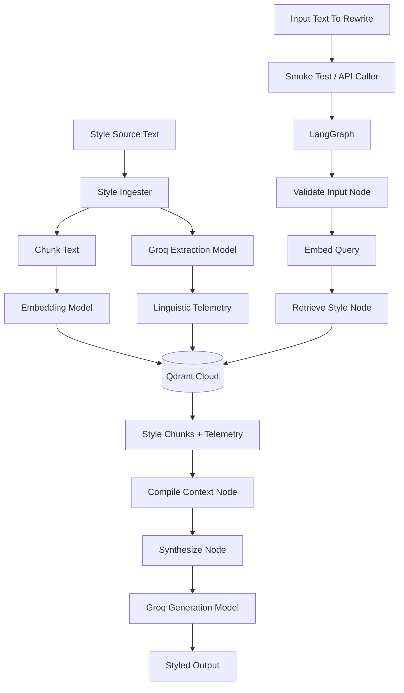

```md
# Primordial VF Architecture

## 1. What We Are Building

Primordial VF, also called Voice Forge, is a style transformation system.

The core product promise is:

- a user uploads writing with a style they admire
- the system extracts a reusable style profile from that writing
- the user submits new text
- the system rewrites the new text using the captured style

The current MVP is style-first. Factual knowledge grounding may be added later, but the first goal is to prove voice capture and voice application.

## 2. Current Architecture

Primordial VF currently has four main layers:

- Style ingestion
- Vector storage
- LangGraph orchestration
- Groq generation

The first working pipeline is:

```text
style sample -> Groq telemetry extraction -> embedding -> Qdrant Cloud
input text -> LangGraph -> style retrieval -> prompt compilation -> Groq rewrite
```

## 3. Workflow Diagram



## 4. Style Ingestion Layer

The style ingester is the core product primitive.

It accepts a style source and produces:

- normalized text
- overlapping text chunks
- Groq-extracted linguistic telemetry
- embedding vectors
- Qdrant payloads

Each stored style chunk has:

- `source_type = style_anchor`
- `style_anchor_id`
- `chunk_text`
- `chunk_index`
- `telemetry`
- `metadata`
- `created_at`

The telemetry model currently captures:

- sentence rhythm
- paragraph structure
- punctuation density
- pronoun/person signals
- rhetorical devices
- style register
- dominant mood
- style notes

## 5. Qdrant Cloud Layer

Qdrant Cloud stores the style anchors.

The MVP uses a single collection:

```text
vf_corpus
```

Payload indexes are used for retrieval:

- `source_type`
- `style_anchor_id`
- `user_id`

The current retrieval path filters by:

```text
source_type = style_anchor
style_anchor_id = selected anchor
```

## 6. LangGraph Layer

LangGraph is the runtime control plane for style application.

The current graph nodes are:

- `validate_input`
- `retrieve_style`
- `compile_context`
- `synthesize`

The graph state carries:

- `style_anchor_id`
- `input_text`
- `rewrite_instruction`
- `query_vector`
- `style_chunks`
- `telemetry_blueprint`
- `compiled_prompt`
- `generation`
- `error`

## 7. Groq Layer

Groq is used in two places:

- style extraction
- final text generation

Current model defaults:

```text
GROQ_EXTRACTION_MODEL=llama-3.1-8b-instant
GROQ_GENERATION_MODEL=llama-3.3-70b-versatile
```

The extraction model returns structured telemetry that is validated by Pydantic.

The generation model receives:

- user input text
- retrieved style samples
- telemetry blueprint
- rewrite instruction

## 8. Current Validation Status

The first working demo has completed successfully.

The system can now:

- ingest a demo style anchor
- extract telemetry with Groq
- embed and store the style chunk in Qdrant Cloud
- retrieve the style anchor through LangGraph
- generate a rewritten output through Groq

The current quality gap is style strength. The first output preserved meaning, but it sounded more formal and polished than the sparse literary style anchor. The next tuning step is stronger prompt pressure in `compile_context.py`.

## 9. Deferred Architecture

The following are not part of the current working MVP yet:

- FastAPI routes
- Supabase integration
- auth
- user workspaces
- file upload storage
- knowledge ingestion
- factual grounding
- streaming responses
- observability
- parallel Groq extraction swarm
```